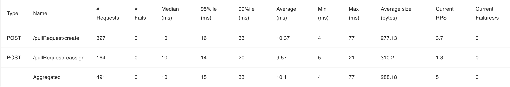
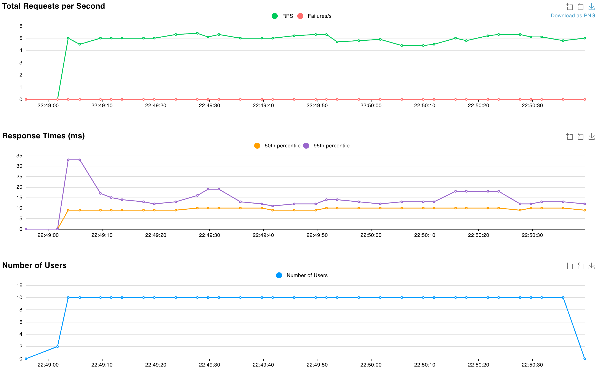

# PR Reviewer Assignment Service

Сервис назначения ревьюеров для Pull Request'ов.

## Требования
- Docker + Docker Compose
- Свободные порты: `8080` (HTTP), `5432` (PostgreSQL) или переопределите `APP_PORT`/`DB_PORT`

## Как запускать
- `make compose-up` — поднимет Postgres, применит миграции и запустит сервис на `http://localhost:8080`.

## Как тестировать
- `make test` — интеграционные тесты репозитория
- `make e2e` — e2e тесты на отдельном docker-compose окружении

## Нагрузочное тестирование

Запуск локально: `make load-test` — поднимет compose, очистит БД, зальёт данные для нагрузочного теста и запустит Locust. Требуются `python3` и установленный `locust`.




Требования: "RPS — 5, SLI времени ответа — 300 мс, SLI успешности — 99.9%" на данных 20 команд по 10 человек выполняются.

## Коротко про API
- `POST /team/add` — создать или обновить команду с участниками.
- `GET /team/get` — вернуть команду по `team_name`.
- `POST /users/setIsActive` — включить/выключить пользователя по `user_id`.
- `GET /users/getReview` — PR'ы, где пользователь ревьювер.
- `POST /pullRequest/create` — создать PR и назначить ревьюверов.
- `POST /pullRequest/merge` — отметить PR как merged.
- `POST /pullRequest/reassign` — заменить ревьювера по `old_user_id`.
- `GET /stats/byUser` — агрегированная статистика по пользователям.
- `GET /stats/byPullRequest` — агрегированная статистика по PR.

## Примеры использования
```bash
# Создать команду
curl -X POST http://localhost:8080/team/add \
  -H "Content-Type: application/json" \
  -d '{
        "team_name": "backend",
        "members": [
          {"user_id": "u1", "username": "Alice", "is_active": true},
          {"user_id": "u2", "username": "Bob", "is_active": true},
          {"user_id": "u3", "username": "Eve", "is_active": true}
        ]
      }'

# Получить команду
curl "http://localhost:8080/team/get?team_name=backend"

# Деактивировать пользователя
curl -X POST http://localhost:8080/users/setIsActive \
  -H "Content-Type: application/json" \
  -d '{"user_id":"u2","is_active":false}'

# Создать PR и получить назначенных ревьюверов
curl -X POST http://localhost:8080/pullRequest/create \
  -H "Content-Type: application/json" \
  -d '{"pull_request_id":"pr-1001","pull_request_name":"Add search","author_id":"u1"}'

# Отметить PR как MERGED
curl -X POST http://localhost:8080/pullRequest/merge \
  -H "Content-Type: application/json" \
  -d '{"pull_request_id":"pr-1001"}'

# Переназначить ревьювера
curl -X POST http://localhost:8080/pullRequest/reassign \
  -H "Content-Type: application/json" \
  -d '{"pull_request_id":"pr-1001","old_user_id":"u2"}'

# PR'ы, где пользователь ревьювер
curl "http://localhost:8080/users/getReview?user_id=u2"

# Посмотреть статистику
curl http://localhost:8080/stats/byUser
curl http://localhost:8080/stats/byPullRequest
```
